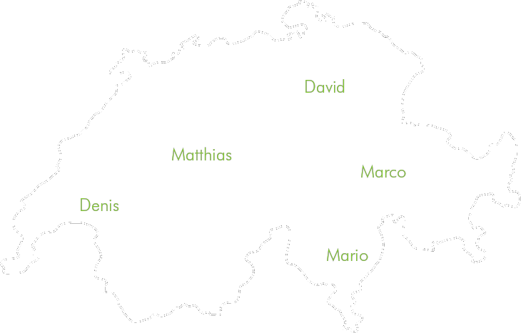
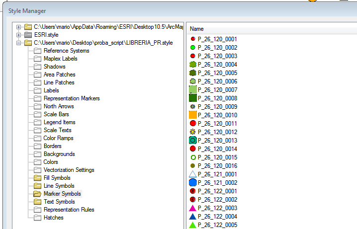
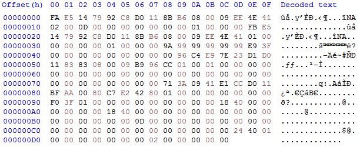
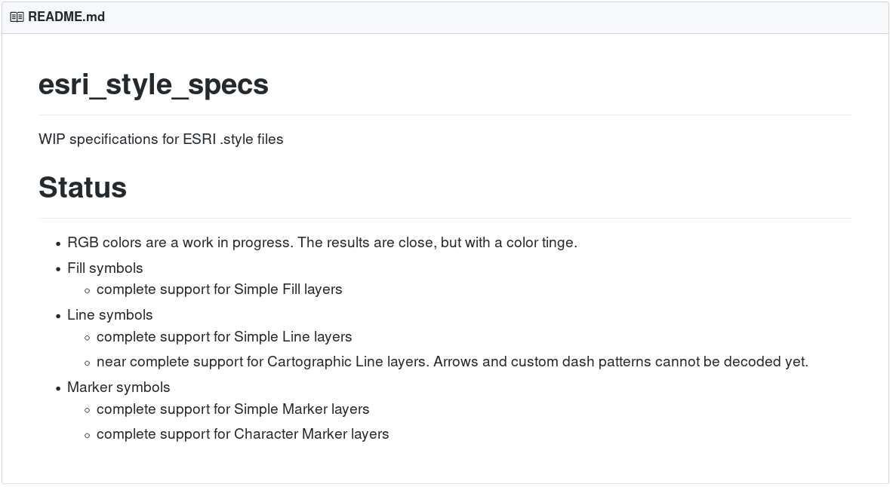

---
@title[Title]

## GIS Migration Paths
#### Tools and strategies to move to open source GIS
 
 
 
 
FOSS4G 2019, Bucharest - August 29, 2019

Note:
Good afternoon everybody and welcome to my presentation.

---
@title[Who am I?]
## Who am I?
Mario Baranzini  
BSc in Computer Science  
Developer, Consultant, Teacher, Student

Note:
just 2 words about me...
My name is Mario Baranzini.
I work as a developer (mostly on Python and Java), a consultant, and a teacher in the GIS field. But I also try to always improve my Software engineering skills. I come from the Italian speaking part of Switzerland (so sorry for my English...).

---
@title[OpenGIS.ch]
### OPENGIS.ch
Open source Geo-spatial Experts at your doorsteps

Note:
I work in a small distributed company called OpenGIS.ch. We are
specialized on open-source GIS and web development for small and medium
businesses.

---
@title[Today]
## Today's presentations
- 14:00-14:20
  - GIS Migration Paths - Tools and strategies to move to open source GIS
- 14:30-14:50
  - From proprietary GIS to OpenSource: overview of a software stack
- 15:00-15:20
  - It's open source, how could that possibly go wrong!?

Note:
This afternoon in this room, there will be 3 presentations that talk about migrations to open source GIS. We agreed on the contents to avoid being repetitive and propose something interesting.

I'll give you an introduction on the subject. I will explain what are the different elements to be considered and what difficulties can be encountered in a migration to open-source software. I will also show you an example of an ad hoc solution that we helped to develop and what benefits came from it.

In the second presentation, we will give an overview of a coherent stack of existing open-source alternatives that can well replace the commercial counterparts and the benefits that result from the adoption of these products.

Finally, in the third presentation, Marco, will talk mainly about the economic aspects of a migration.

---
@title[What]
## What is to be migrated?

Note:
When it comes to migrating, we're talking about converting a gis architecture or part of it. But what elements are we talking about? Let's have a quick overview. Vincent will present alternatives for each of these elements. An open source stack that can be used instead of closed ones.

+++
## Tools

- Desktop GIS
- Mobile GIS
- Web GIS
- Server
- DBMS
- ...

Note: GIS Desktop. A geographic information system (GIS) for gathering,
managing, and analyzing data. 

+++
- Workflows
- Knowledge
- Documentation

Note:
There are not only tools to replace with alternatives but also workflows, scripts for importing or manipulating data, knowledge, documentation, etc..

---
## Why?

Note:
Why should we change the solution we have and convert everything to open source? What are the advantages?

+++
- Freedom from lock-in
- Security and transparency
- Knowledge on what the software does
- Flexibility to change and improve
- Speed of improvements
- Contribute to the community

Note:
Moving to open-source we get rid of vendor lock-ins. We can know exactly what our software does and we have the possibility to modify it quickly in case of need. We have the guarantee that the code will always be available in the future and we will be able to access our data regardless of the will or failure of one private company.

---
@title[Obstacles]
## What obstacles do we face?

Note:
There are many obstacles that can arise when migrating to an open-source GIS solution. Some are easily solved, others can be more challenging. However, knowing what they can be allows us to take preventive measures and to be prepared when we have to deal with them. 

+++
- Vendor lock-in
- Proprietary formats
- Vendor support
- Not knowing what the software does
- Staff training
- Staff's resistance to change
- Find new partners

Note:
Clearly, vendors of proprietary solutions do not want you to change solutions and usually do not simplify the transition to other solutions and sometimes do everything possible to try to prevent it.
One of the main obstacles to moving from proprietary to open source solutions, in any area, not just GIS, is the use of proprietary, undocumented formats. 

Proprietary formats may force us to reverse engineer to extract our data if there are no tools in place to do so. And the proprietary software provider will probably not provide support in this direction.

Sometimes it is difficult, for example, to recreate a workflow if we don't know exactly how it is run by proprietary software and we need to deeply analize and test it.

We need to find new partners to develop the tools they need, to get support with new open-source programs and to acquire the necessary knowledge. But this is an easily overcome obstacle as there are several companies that can do it. For example us.

---
@title[Strategy]
## What strategy to adopt?

Note: 
It is not possible to define a solution that is valid for everyone. Depending on the software used, there may be different solutions to the existing architecture.
One possible approach could be to allow access to data from both solutions so that they can run in parallel and then work on specific points, one at a time. We will soon see an example of how we worked on one of these points.

---
@title[Slyr]
## Symbols example

+++
@title[The Problem]
## The problem
@div[left-50]
 

@divend

@div[right-50]
 
@ul
- 1203 ESRI Symbols
- Points, Lines, Polygons
- Extensive use of ESRI Fonts
@ulend
@divend

Note:
It all started last year, when a client, a public administration who has
always worked with ESRI finally decided to support QGIS users and start using it
to publish their projects. But over the years they have created a library of
over 1200 symbols that are used in various places. The library includes symbols
for points, lines, and polygons and makes extensive use of ESRI fonts.

+++
@title[Requirements]
## Requirements</slyr>
- QGIS XML Library with all the symbols
- No proprietary fonts

Note:
The customer wanted as a result an xml library with the symbols that can be
imported and used in QGIS. He didn't want to install proprietary fonts on and so
all symbols using ESRI characters will have to be converted in some way.

+++
@title[Difficulties]
## Difficulties
- No tools with the required quality

Note:
There were no tools to automatically convert symbols with the quality we
needed. There are some proprietary tools, but they can only convert very simple
symbols for which there is a exact counterpart in QGIS and do not allow to
handle more complex things such as converting characters or symbols with an
image inside or with multiple conversion steps.

+++
@title[ESRI Symbols]
## ESRI Symbols

@div[left-50]
 

@divend

@div[right-50]
 
@ul
- Difficult to interpret binary files
- Bad ArcGIS Python API for symbols
@ulend
@divend

Note:
ESRI symbols are saved in rather complex and difficult to interpret binary
files. Unfortunately, ArcGIS' Python programming interface allows only a very
small amount of symbol information to be extracted. Unlike PyQGIS which allows
you to interact on every aspect of symbols.

+++
@title[How Could We Do That?]
### How Could We Do That?
By hand?  

Note:
The idea of converting them by hand never seemed to us to be a good idea. In
addition to the tedious and repetitive work, it would be an end in itself, which
would not produce anything useful for other users and would always require
manual intervention in case of modification to the original symbols.

But at first analysis it seemed almost impossible to create a tool capable of
correctly interpreting the binary symbols and to recreate them in QGIS.

+++
@title[ESRI Style Specs]
## ESRI Style Specs

Note:
We remembered that Nyall had started working on a project to try to read and
interpret the binary files of the ESRI symbols. He was at the beginning and was
only able to interpret a small part of the information we were interested
in. But it gave us hope that the project could evolve and support more
features. In any case, it would reduce the number of symbols to be converted
manually. We therefore decided to contribute with Nyall to the development of this tool
(which was renamed to SLYR).

+++
@title[SLYR]

https://github.com/nyalldawson/slyr/

Note:

+++
@title[Features]
## Features
- complete support for fill types
- complete support for line types
- complete support for marker types
- conversion of fonts to svg
- conversion of pictures
- complete support for colors
- conversion of color ramps
- available as python scripts or QGIS processing algorithms

Note:
There is a crowdfounding to develop new features, such as converting MXD files

+++
@title[Demo]

---
@title[Conclusion]
## Conclusion

Thanks for your attention

Note:
It is not easy to migrate, there may be various obstacles, costs and problems. But, as we have seen, we can get great benefits from it and we can use a migration as we did with Slyr to create tools that will help everyone and help make the world a better place.
